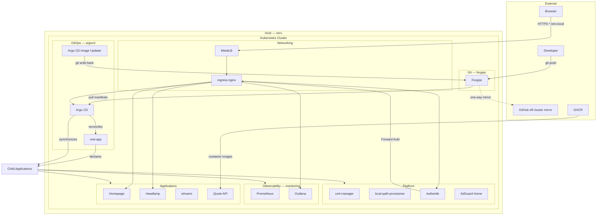

# NERV Architecture

GitOps-managed Kubernetes homelab running on Ubuntu. This document describes the architecture as defined in this repository.

## High-level overview

NERV is a single-node Kubernetes cluster bootstrapped with kubeadm and managed declaratively through Argo CD. Application and platform configuration lives in Git; **Forgejo is the authoritative Git source**. Developers push to Forgejo; Argo CD pulls from Forgejo using the in-cluster Service URL. Forgejo pushes automatically to GitHub as a one-way, off-cluster mirror. GitHub is not in the active GitOps execution path.

The stack includes:

- **Cluster**: kubeadm, containerd, Cilium CNI, Kubernetes v1.34.9
- **GitOps**: Argo CD v3.4.4 (app-of-apps pattern)
- **Networking**: MetalLB, ingress-nginx
- **TLS**: cert-manager with a mixed model — Forgejo uses the NERV CA (`nerv-ca-issuer`); clients that trust the NERV Root CA automatically trust Forgejo. Most other services use individually self-signed certificates, each requiring separate trust. Migration of remaining services to `nerv-ca-issuer` is future work.
- **Storage**: local-path-provisioner (default StorageClass)
- **Identity**: Authentik (Forward Auth via nginx ingress annotations)
- **Observability**: kube-prometheus-stack (Prometheus + Grafana)
- **Git hosting**: Forgejo (authoritative Git source; Argo CD pulls via in-cluster Service URL)
- **DNS**: AdGuard Home

Applications include Homepage, Headlamp, whoami, Quote API, and platform services listed in the Argo CD Applications directory.

## Component diagram



## Kubernetes architecture

### Cluster

| Property | Value | Source |
|----------|-------|--------|
| Bootstrap tool | kubeadm | `docs/cluster-bootstrap.md` |
| Kubernetes version | v1.34.9 | `docs/cluster-bootstrap.md` |
| Container runtime | containerd | `docs/cluster-bootstrap.md`, `docs/containerd.md` |
| CNI | Cilium | `docs/cluster-bootstrap.md`, `README.md` |
| OS | Ubuntu Server | `docs/cluster-bootstrap.md` |
| Topology | Single-node control plane | `docs/cluster-bootstrap.md` |
| Hostname | `nerv` | `host/nerv/hostname` |
| Workload scheduling | Control-plane taint removed | `docs/single-node-scheduling.md` |

**TODO:** kubeadm init/join commands and Cilium installation steps are not documented in this repository.

### Host prerequisites

Before cluster bootstrap (`docs/kubernetes-prerequisites.md`):

- Swap disabled (persists across reboot)
- Kernel modules: `overlay`, `br_netfilter`
- Sysctl: `net.ipv4.ip_forward=1`, bridge netfilter iptables/ip6tables
- containerd active (`SystemdCgroup = true`, `docs/containerd.md`)

### Namespaces

Argo CD Applications deploy into these namespaces (from Application manifests):

| Namespace | Workload |
|-----------|----------|
| `argocd` | Argo CD, Image Updater, root-app, image-updater CRs |
| `forgejo` | Forgejo |
| `ingress-nginx` | ingress-nginx controller |
| `metallb-system` | MetalLB controller + config |
| `cert-manager` | cert-manager + NERV CA resources |
| `local-path-storage` | local-path-provisioner |
| `monitoring` | kube-prometheus-stack, Grafana/Prometheus ingress, monitoring config |
| `authentik` | Authentik, outpost ingresses |
| `adguard-home` | AdGuard Home |
| `headlamp` | Headlamp |
| `homepage` | Homepage, Quote API |
| `whoami` | whoami |
| `sops-test` | SOPS/KSOPS sandbox |

### Repository layout

```
homelab-nerv/
├── apps/                  # Application manifests (whoami, homepage, quote-api, authentik extras)
├── platform/              # Platform config (argocd, cert-manager, metallb, monitoring, headlamp, authentik)
├── host/nerv/             # Host-level config examples (hosts, ssh, fastfetch)
├── sandbox/               # SOPS test environment
└── docs/                  # Documentation
```

New apps follow the pattern described in `docs/roadmap.md`: namespace, deployment, service, ingress, certificate, and a corresponding Argo CD Application under `platform/argocd/applications/`.

## GitOps workflow

### Source of truth

- **Authoritative Git repository**: `homelab-nerv` hosted in Forgejo
- **Argo CD repository endpoint**: `http://forgejo-http.forgejo.svc.cluster.local:3000/staticparsley/homelab-nerv.git` (internal Kubernetes Service)
- **Branch**: `main`
- **Developer workflow**: Developers push commits to Forgejo (`forgejo.nerv.local`)
- **Argo CD consumption**: Argo CD pulls manifest changes from Forgejo via the internal Kubernetes Service URL above — not from GitHub
- **Off-cluster mirror**: Forgejo pushes automatically to GitHub as a one-way mirror. GitHub is not in the active GitOps execution path (Argo CD, Image Updater write-back, and root-app all target Forgejo)

**TODO:** Forgejo-to-GitHub mirror configuration is not present in this repository's Kubernetes manifests or Forgejo values.

### Bootstrap sequence

Argo CD is installed outside the GitOps loop from `platform/argocd/install/`:

1. Upstream Argo CD v3.4.4 manifests
2. KSOPS Config Management Plugin for SOPS-encrypted manifests
3. Repo-server patch mounting a `sops-age` Secret for age decryption

The root Application (`platform/argocd/root-app.yaml`) points at `platform/argocd/applications/` in Forgejo. Argo CD reconciles `root-app`; syncing it applies the Application manifests in that directory as child Application CRs in the `argocd` namespace. Argo CD then reconciles and synchronizes each child Application independently. All Applications use automated sync with `prune: true` and `selfHeal: true`.

**TODO:** Steps to apply `platform/argocd/install/` and `platform/argocd/root-app.yaml` are not documented.
**TODO:** How the `sops-age` Secret is created is not documented.
**TODO:** Bootstrap before in-cluster Forgejo is available is not documented (root-app and child Applications reference the Forgejo cluster URL, while Forgejo itself is deployed by Argo CD).

### App-of-apps

Argo CD reconciles `root-app`, which declares child Applications from `platform/argocd/applications/`. Argo CD synchronizes each child Application to its target namespace and resources.

`root-app` declares 23 child Applications including:

- **External Helm charts**: local-path-provisioner, MetalLB, ingress-nginx, cert-manager, kube-prometheus-stack, Forgejo, Authentik, AdGuard Home, argocd-image-updater
- **In-repo Kustomize/directories**: platform config, apps, image-updater CRs
- **SOPS-backed secrets**: forgejo repository credentials, Authentik secrets, Grafana OAuth secrets, sops-test

### Sync ordering

Explicit sync waves are used for Authentik only:

| Application | Sync wave |
|-------------|-----------|
| `authentik-secrets` | -1 |
| `authentik` | 0 |

**TODO:** Explicit ordering for other platform dependencies (MetalLB → ingress → cert-manager → Forgejo) is not defined.

### Image updates

Argo CD Image Updater (`docs/argocd-image-updater.md`) watches the published container image for Quote API:

- **Source code repository:** GitHub (`quote-api`)
- **Container registry:** `ghcr.io/staticparsley/quote-api`
- **Update strategy:** semver
- **Write-back target:** `apps/quote-api/kustomization.yaml` in the `homelab-nerv` GitOps repository

Current flow:

```text
quote-api source (GitHub)
        ↓
GitHub Actions
        ↓
GHCR
        ↓
Argo CD Image Updater
        ↓
homelab-nerv (Forgejo)
        ↓
Argo CD
        ↓
Kubernetes Deployment
```

After Image Updater commits the updated image tag to the GitOps repository in Forgejo, Forgejo automatically mirrors that commit to GitHub. The application source repository and CI pipeline remain on GitHub; only the GitOps manifests are authoritative in Forgejo.

**TODO:** Verify that the `image-updater-git-creds` Secret uses Forgejo credentials so automated write-back succeeds after the GitOps repository migration.

### Day-to-day workflow

```
Developer → git push → Forgejo → Argo CD → Kubernetes
                          ↓
                    GitHub (off-cluster mirror, not in GitOps path)
```

Argo CD's own runtime config (ingress, TLS, `server.insecure`) is managed by the `argocd-config` Application from `platform/argocd/config/`.

## Networking

### LAN request path

From `docs/network.md`:

```
browser → /etc/hosts or DNS → MetalLB IP → ingress-nginx → Ingress (Host header) → Service → Pod
```

### MetalLB

- **Mode**: L2 advertisement on interface `enp3s0` (`platform/metallb/l2advertisement.yaml`)
- **Address pool**: `192.168.1.240–192.168.1.245` (`platform/metallb/ipaddresspool.yaml`)
- **Example IP**: `192.168.1.240` referenced in `docs/network.md`

### ingress-nginx

- Helm chart from `kubernetes.github.io/ingress-nginx` (v4.12.0)
- Controller Service type: `LoadBalancer`
- Ingress class: `nginx`

### AdGuard Home DNS

AdGuard Home exposes DNS as a LoadBalancer Service with a fixed IP:

- **DNS**: `192.168.1.241:53` (`platform/argocd/applications/adguard-home.yaml`)
- **Web UI**: `adguard.nerv.local` via ingress (protected by Authentik)

### Hostname resolution

**TODO:** LAN DNS is not configured in this repository. `docs/roadmap.md` notes `/etc/hosts` entries are needed until LAN DNS exists. The checked-in `host/nerv/hosts` file contains no `*.nerv.local` entries.

### Exposed hostnames

| Hostname | Service | Auth |
|----------|---------|------|
| `argocd.nerv.local` | Argo CD | None (in repo) |
| `forgejo.nerv.local` | Forgejo | None (in repo) |
| `authentik.nerv.local` | Authentik | N/A (identity provider) |
| `homepage.nerv.local` | Homepage | Authentik Forward Auth |
| `headlamp.nerv.local` | Headlamp | Authentik Forward Auth (configured, unverified) |
| `grafana.nerv.local` | Grafana | Generic OAuth (Authentik) |
| `prometheus.nerv.local` | Prometheus | None (in repo) |
| `whoami.nerv.local` | whoami | None (in repo) |
| `quote.nerv.local` | Quote API | None (in repo) |
| `adguard.nerv.local` | AdGuard Home | Authentik Forward Auth |

### External access

From `README.md`, traffic enters via a Verizon router to MetalLB. No ingress or LoadBalancer configuration for external (non-LAN) access is defined.

**TODO:** WAN/internet exposure details are not documented.

## Storage

### Provisioner

- **local-path-provisioner** (Helm chart v0.0.33) is the default StorageClass (`platform/argocd/applications/local-path-provisioner.yaml`)

### Persistent volumes in use

| Workload | StorageClass | Size | Source |
|----------|-------------|------|--------|
| Forgejo | `local-path` | 20Gi | `apps/forgejo/values.yaml` |
| Authentik PostgreSQL | `local-path` | 8Gi | `platform/authentik/values.yaml` |
| AdGuard Home (conf) | TODO | 256Mi | `platform/argocd/applications/adguard-home.yaml` |
| AdGuard Home (work) | TODO | 2Gi | `platform/argocd/applications/adguard-home.yaml` |

Forgejo uses SQLite (`database.DB_TYPE: sqlite3` in `apps/forgejo/values.yaml`); bundled PostgreSQL/Redis/Valkey are disabled.

Homepage uses ConfigMaps and an `emptyDir` for logs (`apps/homepage/deployment.yaml`); no PVC.

**TODO:** StorageClass for AdGuard Home persistence is not specified in the Application values.

## Secrets management

### SOPS + age

- Encrypted files match `.*\.sops\.ya?ml$` (`.sops.yaml`)
- Encryption uses age (`creation_rules` in `.sops.yaml`)

Encrypted secret sources:

| Path | Consumed by |
|------|-------------|
| `platform/argocd/repository-secrets/` | Argo CD repository credentials |
| `platform/authentik/secrets/` | Authentik bootstrap and PostgreSQL credentials |
| `platform/monitoring/secrets/` | Grafana OAuth credentials |
| `sandbox/sops-test/` | KSOPS validation |

### KSOPS in Argo CD

The Argo CD repo-server is patched (`platform/argocd/install/repo-server-ksops-patch.yaml`) to:

1. Install KSOPS v4.5.1 and kustomize into `/custom-tools`
2. Run a CMP sidecar (`ksops-v1.0` plugin) that executes `kustomize build --enable-alpha-plugins --enable-exec`
3. Decrypt SOPS files using the `sops-age` Secret mounted at `/home/argocd/.config/sops/age/keys.txt`

Applications referencing the KSOPS plugin: `forgejo-repository-secrets`, `authentik-secrets`, `grafana-oauth-secrets`, `sops-test`.

Kustomize secret generators use the KSOPS generator type (`viaduct.ai/v1`) in each secrets directory.

**TODO:** How the age private key is provisioned into the `sops-age` Secret is not documented.

### TLS

cert-manager issuers (`platform/cert-manager/`):

1. `selfsigned-cluster-issuer` — per-service self-signed certificates
2. `nerv-root-ca` — CA certificate (10-year duration) signed by the self-signed issuer
3. `nerv-ca-issuer` — issues certs signed by the NERV Root CA

#### Mixed TLS model (current state)

NERV currently operates a mixed TLS model:

| Issuer | Services | Source |
|--------|----------|--------|
| `nerv-ca-issuer` (NERV CA) | Forgejo (`forgejo.nerv.local`) | `apps/forgejo/values.yaml` |
| `selfsigned-cluster-issuer` (individually self-signed) | Argo CD, Authentik, Homepage, whoami, Quote API, Grafana, AdGuard Home | Certificate resources and Helm ingress annotations across `apps/`, `platform/`, and Application values |

Argo CD trusts the NERV Root CA when communicating with Forgejo via `platform/argocd/config/tls-certs.yaml`.

Clients that trust the NERV Root CA automatically trust Forgejo (`forgejo.nerv.local`). Services on `selfsigned-cluster-issuer` each receive a distinct certificate that is not chained to the NERV Root CA; those certificates require separate trust or manual acceptance per service.

#### Future work

Migrate remaining ingress TLS certificates from `selfsigned-cluster-issuer` to `nerv-ca-issuer`. Once complete, clients need only trust the NERV Root CA once to reach all services.

## Observability

### Stack

- **kube-prometheus-stack** (Helm chart v66.2.1) in the `monitoring` namespace
- Grafana and Prometheus exposed via ingress at `grafana.nerv.local` and `prometheus.nerv.local`
- Prometheus retention: 7 days
- `serviceMonitorSelectorNilUsesHelmValues: false` — discovers ServiceMonitors cluster-wide

### Metrics sources

| Target | Mechanism | Source |
|--------|-----------|--------|
| Authentik server/worker | Helm ServiceMonitor | `platform/authentik/values.yaml` |
| Quote API | ServiceMonitor (`/metrics`, 30s) | `apps/quote-api/servicemonitor.yaml` |
| Headlamp | Container port 9090 named `metrics` | `platform/headlamp/deployment.yaml` |

**TODO:** Whether Headlamp metrics are scraped by Prometheus is not configured in this repository (no ServiceMonitor for Headlamp).

### Grafana authentication

Grafana uses generic OAuth against Authentik (`platform/argocd/applications/kube-prometheus-stack.yaml`):

- OAuth credentials loaded from Secret `grafana-authentik-oauth` (SOPS-managed via `grafana-oauth-secrets` Application)
- Token/userinfo endpoints use in-cluster Authentik service URLs

### Monitoring config

The `monitoring-config` Application syncs `platform/monitoring/`, which contains Grafana TLS certificate resources and the secrets subdirectory.

**TODO:** `platform/monitoring/` has no root `kustomization.yaml`; Argo CD applies the directory contents directly.

### Dashboard entry point

Homepage lists Grafana and Prometheus under an "Observability" section (`apps/homepage/configmap.yaml`).

## Authentication

### Identity provider

**Authentik** (Helm chart from `charts.goauthentik.io`, targetRevision `^2026.5`):

- 1 server replica, 1 worker replica
- Ingress at `authentik.nerv.local`
- Embedded PostgreSQL (8Gi, `local-path`)
- Secrets injected from `authentik-secrets` (SOPS, sync wave -1)
- Server/worker metrics enabled with ServiceMonitors

### Forward Auth pattern

Protected applications use nginx ingress annotations pointing to Authentik's embedded outpost:

```
auth-url:   http://authentik-server.authentik.svc.cluster.local:80/outpost.goauthentik.io/auth/nginx
auth-signin: https://<app>.nerv.local/outpost.goauthentik.io/start?rd=...
```

Used by: Homepage, Headlamp, AdGuard Home.

Each protected app requires a dedicated outpost ingress in the `authentik` namespace (`apps/authentik/*-outpost-ingress.yaml`), deployed via the `authentik-extras` Application. The runbook (`docs/authentik-runbook.md`) documents the manual steps to create Authentik Applications, Proxy Providers, and assign them to the Embedded Outpost.

Headlamp has Forward Auth ingress annotations and an outpost ingress manifest (`platform/headlamp/ingress.yaml`, `apps/authentik/headlamp-outpost-ingress.yaml`), but end-to-end Forward Auth for Headlamp is not verified in this repository. Provider and outpost assignment may still require manual steps in the Authentik UI per the runbook.

**TODO:** Headlamp Forward Auth end-to-end behavior is not verified in this repository.

### Grafana OAuth

Grafana authenticates via Authentik generic OAuth (configured in the kube-prometheus-stack Helm values). OAuth client credentials are stored in SOPS-encrypted secrets.

### Unprotected services

The following have ingress but no Authentik annotations in this repository:

- Argo CD (`argocd.nerv.local`)
- Forgejo (`forgejo.nerv.local`)
- whoami (`whoami.nerv.local`)
- Quote API (`quote.nerv.local`)
- Prometheus (`prometheus.nerv.local`)

### RBAC

| Component | RBAC | Source |
|-----------|------|--------|
| Headlamp | `cluster-admin` via ClusterRoleBinding | `platform/headlamp/clusterrolebinding.yaml` |
| Homepage | ClusterRole (read-only: pods, services, namespaces, nodes, deployments, ingresses) | `apps/homepage/clusterrole.yaml` |

## Known limitations

Documented or inferable from the repository:

1. **Single-node cluster** — no HA; control-plane taint removed to schedule workloads on the sole node (`docs/single-node-scheduling.md`).
2. **Future scaling via kubeadm join** — noted in `docs/cluster-bootstrap.md`; not yet implemented.
3. **Forgejo on SQLite** — bundled PostgreSQL/Redis/Valkey disabled (`apps/forgejo/values.yaml`).
4. **Mixed TLS model** — Forgejo uses the NERV CA (`nerv-ca-issuer`); clients that trust the NERV Root CA automatically trust Forgejo. Most other services still use individually self-signed certificates via `selfsigned-cluster-issuer`, each requiring separate trust or manual acceptance. Migration of all services to `nerv-ca-issuer` is future work.
5. **LAN hostname resolution** — `*.nerv.local` requires `/etc/hosts` or LAN DNS (`docs/roadmap.md`); no DNS server config is in-repo.
6. **GitOps bootstrap gap** — root-app depends on in-cluster Forgejo, which is itself deployed by Argo CD; initial bootstrap procedure is not documented.
7. **Incomplete secret bootstrap docs** — `sops-age` Secret creation and Argo CD install steps are not documented.
8. **Authentik outpost setup is partially manual** — provider/outpost assignment requires steps in the Authentik UI (`docs/authentik-runbook.md`).
9. **Forgejo registration open** — `DISABLE_REGISTRATION: false` in `apps/forgejo/values.yaml`.
10. **MetalLB pinned to one interface** — L2 advertisement only on `enp3s0`.
11. **Fixed AdGuard DNS IP** — `192.168.1.241` must be available in the MetalLB pool.
12. **Headlamp TLS** — ingress references `headlamp-tls` Secret but no Certificate resource exists in `platform/headlamp/`.
13. **Prometheus unauthenticated** — no ingress auth annotations on the Prometheus ingress (configured in kube-prometheus-stack Helm values).
14. **Planned but not deployed** — Jellyfin and Photo of the Day listed as "Coming Soon" in Homepage config and README.

## Architecture decisions

- GitOps source of truth is Forgejo.
- GitHub is maintained as a one-way off-cluster mirror.
- Argo CD consumes Git through the internal Kubernetes Service rather than the external ingress.
- Secrets are encrypted with SOPS (age) and decrypted by KSOPS inside Argo CD.
- TLS is transitioning from individually self-signed certificates to a shared internal CA (`nerv-ca-issuer`).
